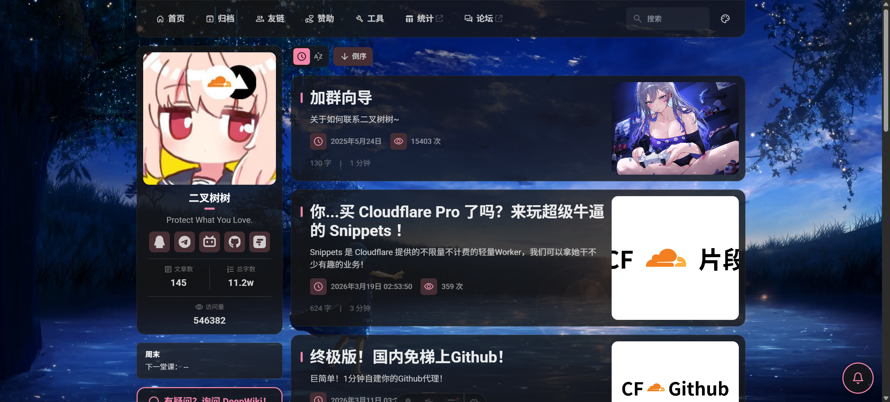
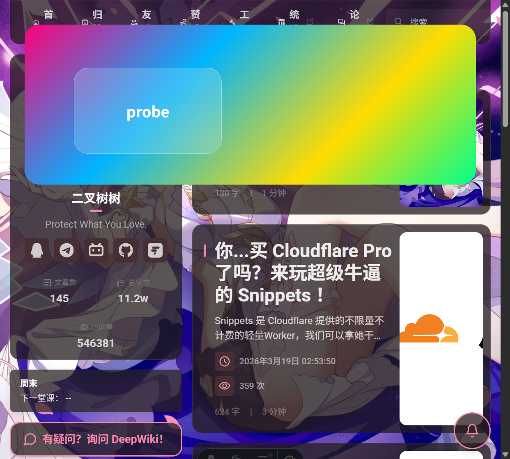
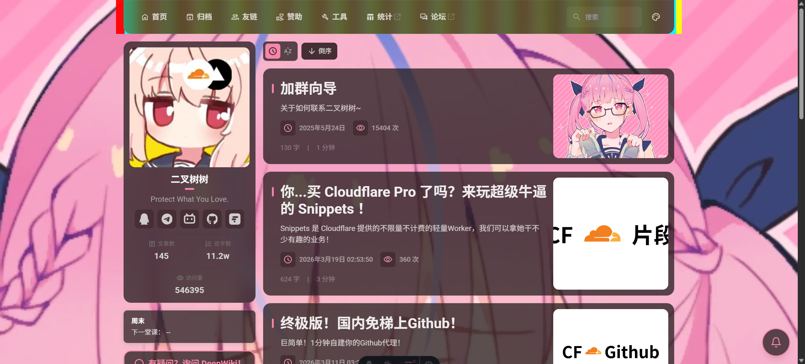

# 起因

这几天我一直在修博客里一个特别折磨人的视觉问题。

一开始最让我困惑的地方在于：**Firefox 里的毛玻璃始终是正常的，而且几乎稳如老狗**。

更具体一点说，在最开始那一阶段，如果我**不动底层结构，只是单纯给容器补高斯模糊相关 CSS**，结果会非常分裂：

- Firefox 会稳定生效；
- Chromium 则始终不正常；
- 如果继续把模糊力度加大，Chromium 还会出现异常闪烁。

这说明它并不是一个“所有浏览器都不支持 `backdrop-filter`”的简单兼容性问题，也不能粗暴理解成“Chromium 根本没有渲染”。更像是：

- 首页卡片、导航栏、搜索面板这些原本带 **毛玻璃效果** 的容器，在 Chromium 系浏览器里某些 Swup 跳转之后会突然失效；
- 有时候不是彻底失效，而是 **切页完成后一小段时间才“慢半拍”恢复模糊**；
- 背景图之前又挂在 `body` 上，滚动和页面切换时会有明显的跑动和跳跃；
- 甚至当我一度把 Swup 动画削弱后，模糊会恢复；可一旦再把原来的动画还原，高斯模糊又会重新变得不稳定。

所以现在回头看，更合理的判断应该是：**Chromium 不是完全没渲染，而是 blur 的采样失败、采样源错误，或者采样链本身不稳定。**

如果只看单个现象，其实都像是一个普通样式 Bug；但把它们放在一起看，就会发现这不是某一行 CSS 写错了，而是 **Chromium 下的渲染链、Swup 原动画、背景承载方式和切页时序一起打架**。

这篇文章就记录一下这次排查过程，以及最后是怎么把它们修回去的。

# 第一反应：是不是 `backdrop-filter` 本身坏了？

遇到毛玻璃失效时，第一反应通常都是：

1. `backdrop-filter` 写法是不是不兼容；
2. 某个祖先是不是不透明了；
3. 背景图是不是没铺到正确位置；
4. 又或者是 Chromium 某个奇怪的合成层行为。

但因为 Firefox 一直正常，而且单纯补 CSS 时只有 Chromium 出问题，所以我很早就知道：

> 问题大概率不在“有没有写 blur”，而在 **Chromium 下这层 blur 到底采样到了什么，以及这条采样链是否稳定**。

所以最开始我并没有急着改大结构，而是先做了一轮“拆因子”测试：

- 测试是背景本身有问题，还是 blur 采样链有问题；
- 测试是 `body` 背景导致的，还是局部容器导致的；
- 测试是容器本身没有 blur，还是 blur 被 Swup 切页过程暂时打断了。

下面这张图就是当时为了看导航栏和背景层关系时留下来的调试截图：

查到这里其实已经能排除掉一种常见误判：

> 不是 `.card-base` / `.float-panel` 这些类本身突然不会 blur 了，问题更像是“它们在某些时刻拿不到可采样的背景”。

# 真正的第一个坑：背景承载方式来回变过三次

这里需要先把时间线说准确。

最开始，背景图其实**不是直接挂在 `body` 上**，而是挂在遗留的 `#bg-box` 容器上。

之所以会有这个 `#bg-box`，是因为更早之前我的随机背景图逻辑依赖一段 JS：

- 先生成随机数；
- 再拼接 URL；
- 最后把结果写到背景容器上。

后来我把随机背景的来源改了：不再让前端自己随机拼接，而是改成请求一个**固定 URL**，再由后端返回 **302 重定向** 到随机图片。

也正因为这样，后面我才一度让背景图直接挂到 `body` 上，想着把这层历史包袱顺手简化掉。

所以真实时间轴应该是：

1. **最初仍然使用遗留的 `#bg-box` 容器**；
2. **后来直接挂到 `body` 上**；
3. **最后才演进到现在的 `--bg-image-initial` + 独立固定背景层方案**。

单看这条时间线，其实“挂在 `body` 上”本身并不是最早的问题来源，它更多是中途一次为了适配新背景来源而做的简化尝试。但这个尝试又带来了新的副作用：

- 背景会跟着滚动条跑；
- `background-attachment` 和滚动行为开始互相影响；
- 页面切换时背景和内容的相对关系更不稳定；
- 对 `backdrop-filter` 来说，采样源变得更难稳定控制。

所以这次修复里，真正关键的不是“把原本挂在 body 上的背景搬走”这么简单，而是：

**把背景从历史上的 `#bg-box / body` 这两种过渡方案，统一收敛成一个独立的固定背景层。**

也就是把它变成一个单独的固定元素，专门负责：

- 铺背景图；
- 吃背景模糊、色相旋转、透明度这些变量；
- 始终固定在视口层；
- 不参与正文容器的动画和切页替换。

当时做背景层链路排查时，我还留了一张专门看 DOM 背景层的测试图：

这个改动带来的提升非常明显：

- 背景不再跟着滚动条和 `body` 状态乱跑；
- Swup 切页时背景稳定很多；
- 毛玻璃容器至少重新有了一个明确、固定、可采样的背景来源。

但现在回头看，这一步虽然关键，却还不是全部。因为在更早的测试阶段，光补 blur CSS 时 Firefox 已经稳定有效，而 Chromium 仍然异常，这说明问题从一开始就不是“有没有 blur”，而是 **Chromium 能不能稳定采样到正确背景**。

真正让主容器模糊“终于稳定下来”的，是后面 **背景层独立化 + Swup 动画收敛 + 把 blur 明确补回 `.card-base` / `.float-panel` 这些公共容器类，再让玻璃壳层尽量退出 onload 动画链** 这几步一起完成的。

# 第二个坑：真正最难缠的，其实是 Swup 原动画链

背景层稳定之后，问题并没有完全消失。

而且现在回头按时间线梳理，真正让主容器毛玻璃重新挂起来，并不是单靠“背景层独立”这一步，而是下面这三步连起来：

1. **重新放置背景图**，把背景承载方式从历史方案继续往更稳定的方向推进；
2. **削减 Swup 动画**，先把切页过程收敛成更轻的透明过渡；
3. **把真正承载玻璃效果的公共类重新补上 blur，并尽量让这些壳层退出动画链**。

第三点其实是我后来重新看未提交改动才确认下来的关键步骤。因为在 diff 里，真正直接把毛玻璃重新挂回主容器的，是对共享容器类的处理：

- 给 `.card-base` 明确补上 `backdrop-filter: blur(16px)`；
- 给 `.float-panel` 明确补上 `backdrop-filter: blur(18px)`；
- 同时逐步把像导航栏、侧栏、内容外壳、页脚这类真正承载玻璃效果的壳层，从 `.onload-animation` 里剥出来。

也就是说，正确的理解不应该是“背景层一稳定，模糊就已经完全修好了”，而是：

> **背景层独立化解决了“模糊背后采样谁”的问题；削减 Swup 动画降低了切页干扰；而把 blur 明确补回公共容器类、再让玻璃壳层退出动画链，才真正把主容器毛玻璃重新挂回去。**

接着我才观察到另一个现象：

- 某些页面切换时会“闪两下”；
- 第一闪时玻璃感很弱，第二闪才像是正常状态。

这里要特别说明一下：**出现“闪两下”的那个阶段，其实已经是主容器模糊被成功修回来的阶段了。**

也正因为模糊已经回来了，我才开始更清楚地看到另一层问题：

- Swup 本身会替换内容容器，并对切页容器施加过渡；
- 页面里的很多组件又额外带了 `.onload-animation`；
- 如果容器整体先淡入一次，里面的玻璃卡片再淡入一次，就会形成双重透明阶段；
- 如果切页动画里还带 `transform`、位移或更重的过渡，那么 Chromium 会更频繁地重建合成层；
- 对 `backdrop-filter` 来说，这种“新容器刚插入、祖先正在动画、背景又刚切换”的时刻，视觉上特别容易表现成发虚、延迟、或者第一帧像没模糊。

更要命的是，后面我为了验证问题，一度把 Swup 动画大幅削弱，只保留更轻的淡入淡出，结果模糊明显恢复；但等我再尝试把原来的动画还原，高斯模糊又重新变得不稳定。

到这里我才真正意识到：

> 根因并不是 Swup “这个库本身坏了”，而是 **当前这套页面结构里的毛玻璃实现，扛不住 Swup 原本那条动画链**。

所以后面我做的策略其实很简单：

**不要让真正承载玻璃效果的那一层自己反复淡入。**

换句话说：

- 玻璃壳本身尽量保持静态可见；
- 如果要做动画，优先让内部内容动，而不是整张玻璃卡片一起动；
- Swup 过渡和页面 onload 动画只能保留一种主导关系，不能互相叠加。

为了验证这一点，我还专门留了一个“关闭那部分 onload 动画后”的截图：

最后实践下来，确实证明了一个经验：

> 对毛玻璃 UI 来说，最怕的不是 blur 半径写得不对，而是承载 blur 的那层壳自己在切页时不停参与透明动画和重建合成层。

# 第三个坑：右侧 TOC 明明写了 blur，却看起来像没生效

这部分其实是最有意思的一个坑。

因为从样式上看，右侧 TOC 卡片已经有：

- 半透明背景；
- `backdrop-filter`；
- 边框和圆角。

照理说它应该正常毛玻璃才对。

但实际页面里，它就是看起来像“只有深色底，没有高斯模糊”。

后来继续顺着渲染链往上看，终于定位到真正原因：

- TOC 外层滚动容器为了做上下渐隐，挂了 `mask-image`；
- 而 TOC 卡片本身的 blur 是它的后代；
- 在 Chromium 下，**祖先带 `mask-image` 时，后代的 `backdrop-filter` 很容易直接失效或近似失效**。

也就是说，那时候不是 TOC 没写 blur，而是 blur 的采样链被祖先的 mask 裁掉了。

这个问题的经验意义很大：

> 只看目标元素的样式，往往找不到问题。真正让 `backdrop-filter` 失效的，常常是祖先链上的 `mask`、`filter`、`transform`、`isolation`、`overflow`、或者某些会触发独立合成层的属性组合。

# 这次所有未提交改动，我按“小改动”拆开列给你看

老实说，到现在我也不敢 100% 断言“到底是哪一步单独修好了问题”。

因为这次毛玻璃恢复，并不是一次线性的“发现根因 → 打补丁 → 完事”，而更像是一连串小改动叠加后，最终让 Chromium 下的采样链逐步稳定下来。

所以与其在文章里强行下结论，不如把当前这批**尚未提交**的改动全部拆开列出来，让读者自己判断哪一步最关键。

## 改动 1：给公共玻璃容器类明确补回 `backdrop-filter`

对应文件：`src/styles/main.css`

这一步做了最直接的事情：

- 给 `.card-base` 明确补上 `backdrop-filter: blur(16px)`；
- 给 `.float-panel` 明确补上 `backdrop-filter: blur(18px)`；
- 后来还顺手给 TOC 单独抽了一个 `.toc-panel`。

如果只从“字面上有没有 blur”来看，这一步当然最像“真正把毛玻璃挂回去”的动作。

但问题在于：在更早的测试里，Firefox 早就证明“光补 CSS 就能稳定生效”，Chromium 却还是不正常，所以这一步虽然必要，却未必足以单独解释为什么最终恢复。

## 改动 2：把背景承载方式从历史方案收敛成独立固定背景层

对应文件：`src/layouts/Layout.astro`

这一步改动其实非常大：

- 去掉旧的 `#bg-box` 过渡思路；
- 不再继续依赖直接挂在 `body` 上的背景；
- 引入 `#site-bg-layer`、`#site-bg-pane-a`、`#site-bg-pane-b`；
- 用 `#site-content` 把正文和背景层彻底分开；
- 背景通过 CSS 变量和独立固定层来统一管理。

这一步的意义是把“模糊到底在采样谁”这件事尽量稳定下来。

如果从渲染链角度看，它很可能是最关键的底层修复之一；但如果没有其他配套改动，它也未必足以让切页中的 blur 彻底稳定。

## 改动 3：削减 Swup 的过渡强度

对应文件：`src/styles/transition.css`

这里做的收敛主要有：

- `transition-all` 改成 `transition-opacity`；
- 去掉位移类的动画影响；
- 避免新内容容器整体和内部子项叠加双重入场效果；
- 增加 `transition-swup-presence` 这类更轻的占位策略。

这是我当时最直观能感受到效果的一组改动，因为只要把 Swup 动画收轻，问题就会明显缓和；但一旦再把原来的动画还原，高斯模糊又会重新变得不稳定。

所以如果让我凭直觉说，**Swup 原动画链** 至少一定是最核心的触发器之一。

## 改动 4：把玻璃壳层从 `.onload-animation` 里剥出来

对应文件：

- `src/layouts/MainGridLayout.astro`
- `src/components/Navbar.astro`
- `src/components/widget/Announcement.astro`

这里做的不是“删动画”，而是重新分配动画落点：

- 让真正承载毛玻璃的外壳尽量保持静态；
- 把动画往更内层内容移动；
- 避免整个玻璃壳体在切页时一起 fade / 重建合成层。

如果读者也在做玻璃拟态 UI，这一步大概会很好理解：

> 普通卡片可以整块做进场动画，但毛玻璃卡片如果连壳层自己都在不断变化透明度和合成状态，视觉上就很容易发虚、闪烁、或者第一帧像没模糊。

## 改动 5：在 Swup 内容替换后尽快清理 `.onload-animation`

对应文件：`src/layouts/MainGridLayout.astro`

这里后面还补了一段脚本逻辑：

- 针对 `#sort-container`、`#swup-container`、`#toc` 这些区域；
- 在 `swup:contentReplaced` 后尽快清理新内容里的 `.onload-animation`；
- 避免这些类在新内容进入后继续长时间保留。

这一步更像是把前一条策略“程序化、系统化”地落了下去。

## 改动 6：调整 Swup 生命周期里的时序

对应文件：`src/scripts/layout-main-runtime.ts`

这部分做的是一些看起来不那么显眼、但可能会影响整体稳定性的细节：

- `lg:is-home` 的切换时机延后；
- `#page-height-extend` 不再在所有切页场景都粗暴显示；
- `visit:end` 阶段的收尾从 `setTimeout` 改成更轻的 `requestAnimationFrame`；
- TOC、滚动状态等恢复时机做了微调。

单看这些逻辑，它们不像是在“修 blur”，但如果这些状态切换影响了背景层、页面高度、首页 banner 或滚动容器，就仍然可能间接影响 `backdrop-filter` 的表现。

## 改动 7：去掉 TOC 祖先容器上的 `mask-image`

对应文件：`src/styles/main.css`

这一步不是修“主容器毛玻璃”的核心动作，而是后面排查右侧 TOC 时发现的单独问题：

- TOC 卡片本身明明写了 blur；
- 但它祖先的 `mask-image` 会让 Chromium 下的 `backdrop-filter` 近似失效；
- 最后去掉这层 `mask-image` 后，TOC 的玻璃才重新变得可信。

这条经验虽然是 TOC 支线，但也反过来提醒我：

> 很多时候你看到“某个 blur 没效果”，问题根本不在它自己，而在祖先链。

## 如果非要我给现在这批改动做一个阶段性判断

那我更愿意把它理解成三类：

### A. 直接把 blur 写回去的改动

- `.card-base` / `.float-panel` 补 `backdrop-filter`

### B. 让 blur 背后真正有稳定可采样背景的改动

- 背景从历史上的 `#bg-box / body` 过渡方案收敛成独立固定背景层

### C. 不再让 Swup 和动画链把 blur 重新打坏的改动

- 削减 Swup 动画强度
- 玻璃壳层退出 `.onload-animation`
- 在内容替换后尽快清理残留动画类
- 调整 Swup 生命周期时序

至于哪一步才是“真正关键的那一步”，老实说我到现在也不敢完全下死结论。

如果你问我个人倾向，我会说：

- **背景层重构**像是在修采样源；
- **Swup 动画收敛**像是在修触发条件；
- **公共玻璃类补 blur**像是在修表层开关；
- **壳层退出动画链**像是在修最终稳定性。

到底是其中哪一步单独决定了成败，还是它们组合起来才让问题真正消失，我更愿意把判断权留给读者。

# 这次排查给我的几个实用结论

如果你也在做类似 Fuwari / Astro / Swup / 玻璃拟态的站点，我觉得下面几条非常实用：

## 结论一：毛玻璃最怕“时序不稳定”

很多时候 blur 不是不能用，而是：

- 元素刚插入；
- 祖先刚做动画；
- 背景刚切换；
- 合成层刚重建；
- 你正好在这个瞬间观察它。

所以视觉问题往往不是静态 CSS 问题，而是 **切页时序问题**。

## 结论二：固定背景层比 `body` 背景更适合复杂毛玻璃站点

特别是页面有：

- 切页动画；
- 大量透明容器；
- 可切换背景图；
- 滚动区和浮层。

这时独立背景层的可控性会好非常多。

## 结论三：祖先 `mask-image` 是 `backdrop-filter` 的高危因素

这一点真的很容易忽略。

如果你发现某个容器：

- 透明度正常；
- 背景色也对；
- 但就是没有真实模糊感；

那就别只盯着这个容器本身，去查它父级、祖先级有没有 `mask-image`，很可能会直接找到答案。

## 结论四：Firefox 正常，并不代表你的实现一定没问题

这次排查里一个很关键的参照物就是：**Firefox 从头到尾基本都正常，而且在最初只补 CSS 的阶段就已经稳定有效**。

这说明至少三件事：

- 不是我根本没把毛玻璃写出来；
- 不是所有浏览器都对这套写法无效；
- Chromium 更像是“有参与渲染，但采样失败、采样源错误，或者采样链不稳定”。

而且有一个很容易被忽略的判断依据：**闪烁本身就是证据**。

如果 Chromium 完全没有参与这层效果的渲染，那它通常只会表现成“像普通半透明背景一样始终没模糊”；但我当时看到的不是这样，而是：

- 模糊强度一变大就开始异常闪烁；
- 某些切页阶段像是短暂出现、又马上失真；
- 动画链一变重，问题就更明显。

这更像是浏览器确实在尝试做这层 blur，只是它在不同阶段**采样到了错误的背景、采样链被打断，或者合成状态还没稳定下来**。换句话说，问题不是“有没有渲染”，而是“渲染时到底在模糊谁”。

所以遇到这类问题时，跨浏览器对照特别重要：

- 如果所有浏览器都坏，那更像是样式本身写错；
- 如果 Firefox 稳定、Chromium 异常闪烁或失真，那就要优先怀疑采样链，而不是简单下结论说“浏览器没渲染”；
- 如果只有 Chromium 系出问题，那就要继续怀疑渲染链、切页动画、祖先层属性与背景承载方式。

## 结论五：玻璃壳尽量别自己做进场淡入

普通卡片做淡入没什么问题，
但毛玻璃卡片本质上是在“采样后面的世界”，
如果连它自己也在切页时不断变化透明度和合成状态，视觉稳定性会变得很差。

## 结论六：追查渲染问题时，先把 JS 和框架干扰降到最低

这是这次排查里最后沉淀出来、但其实非常通用的一条方法论。

如果要追查的是 **渲染问题，尤其是 CSS / `backdrop-filter` / 合成层 / 祖先链** 这类问题，第一步往往不是继续改业务代码，而是先想办法把变量减到最少。

我现在更推荐这样的顺序：

1. **先禁用 JS**，至少先临时排除 Swup 这类会替换 DOM、重绑状态、改写切页过程的运行时因素；
2. 先看“**原生静态 HTML + 原生 CSS**”在浏览器里是否正常；
3. 如果静态状态都不对，再回头查源码里的选择器、父级链路、层叠顺序、`!important`、继承关系；
4. 同时把源码里的样式和**最终构建产物里的 CSS** 对照起来看，确认是不是构建后被覆盖、重排、裁剪或者合并了；
5. 再针对可疑点多写几个 **POC / 最小实验**，故意拆掉复杂结构，验证到底是浏览器兼容性、渲染链限制，还是我们自己代码结构的问题；
6. 最后再做**跨浏览器对照**，比如 Chromium 和 Firefox 同时比较，看看是“实现本身错了”，还是“某一类内核更容易在这条渲染链上出问题”。

这套顺序的核心思想其实很简单：

> 先证明“浏览器在最小环境下能不能正确渲染”，再去怀疑框架、运行时、构建链和项目结构。

否则很容易一上来就把问题全归到某个框架、某段业务逻辑、甚至某条 CSS 上，最后越查变量越多，反而看不清真正的问题链路。

# 写在最后

这次修博客的过程，本来只是想“顺手把 blur 修一下”，结果一路往下挖，最后牵出了：

- 背景层设计；
- Swup 动画时序；
- Chromium 对 `backdrop-filter` 的祖先链限制；
- 以及一个看似不起眼、实际杀伤力很大的 `mask-image`。

所以有时候前端里最折磨人的问题，还真不是业务逻辑，而是这种：

> 每一层都“看起来没错”，但它们一叠起来就开始互相背刺。

不过也正因为这样，最后把问题完整收住的时候，会特别有成就感。

如果后面我把这套 TOC 渐隐再改成不影响 blur 的 overlay 方案，或者把背景切换继续打磨得更顺，我应该还会再补一篇后续。
